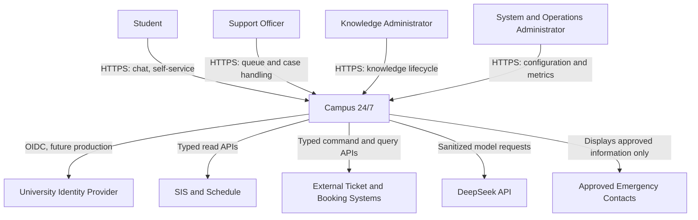

# ARCH-001 — System context

## 1. Quyết định phạm vi

Campus 24/7 là cổng dịch vụ sinh viên có AI cho một cơ sở giáo dục. V1 phục vụ bốn vai trò trong `DEC-006`; không có SaaS multi-tenancy, billing hoặc tenant onboarding. Mọi dữ liệu nhận diện trường và người dùng trong demo là tổng hợp theo `DEC-004`.

### 1.1 Mục tiêu hệ thống

Hệ thống **MUST**:

- trả lời FAQ/quy trình có citation tới nguồn đã duyệt;
- cung cấp lịch cá nhân qua adapter có authorization;
- tạo và theo dõi ticket, yêu cầu giấy tờ và đặt phòng;
- yêu cầu preview + confirmation trước side effect;
- handover trường hợp nhạy cảm, khẩn cấp, ngoại lệ hoặc thiếu bằng chứng;
- cung cấp quản trị tri thức và chỉ số vận hành.

Hệ thống **MUST NOT**:

- quyết định điểm, kỷ luật, tài chính, y tế hoặc pháp lý;
- tự phê duyệt yêu cầu sinh viên;
- hứa có cán bộ trực 24/7 khi chưa có lịch trực được phê duyệt;
- tự tạo số điện thoại/đầu mối khẩn cấp;
- dùng public HUCE content để tuyên bố được HUCE bảo trợ.

## 2. Actor và trách nhiệm

| Actor | Mục tiêu | Quyền tối đa trong V1 | Không được phép |
|---|---|---|---|
| Student | Hỏi đáp, xem lịch của mình, gửi và theo dõi yêu cầu | Đọc dữ liệu của chính mình; xác nhận action do chính mình tạo | Xem dữ liệu người khác; publish knowledge; tự duyệt |
| Support Officer | Nhận, phân loại, xử lý và chuyển ticket | Dữ liệu ticket thuộc queue/đơn vị được gán | Truy cập toàn bộ hồ sơ không liên quan |
| Knowledge Administrator | Nhập, kiểm tra, publish phiên bản tri thức | Corpus và eval thuộc phạm vi được giao | Thay authorization hoặc xem hồ sơ sinh viên ngoài nghiệp vụ |
| System/Operations Administrator | Cấu hình, quan sát, ứng phó sự cố | Runtime configuration và operational metadata theo separation of duties | Đọc nội dung cá nhân mặc định; thay policy không audit |
| University Identity Provider | Xác thực và phát claims trong tương lai | OIDC contract đã phê duyệt | Gọi domain API thay người dùng |
| Institutional Systems | Cung cấp lịch/SIS/LMS và nhận yêu cầu | API contract theo từng adapter | Truy cập nội bộ Campus 24/7 ngoài allowlist |
| DeepSeek API | Sinh output có kiểm soát | Chỉ payload tối thiểu do gateway gửi | Credential, database hoặc tool execution trực tiếp |

## 3. C4 system context

## 4. External-system contract matrix

| Boundary | V1 implementation | Production target | Protocol | Fail-closed rule |
|---|---|---|---|---|
| Identity | `MockIdentityAdapter` với synthetic users | Microsoft Entra ID | OIDC Authorization Code + PKCE | Không có authenticated principal hợp lệ thì trả `401`; không dùng request body làm identity |
| Schedule/SIS | Deterministic mock adapter | API do HUCE phê duyệt | HTTPS/JSON, exact contract TBD | Không có dữ liệu thì trả unavailable; không suy diễn lịch |
| Ticket | Internal bounded context | Có thể đồng bộ hệ thống trường | REST/event adapter | Không xác nhận được write thì không báo thành công |
| Room booking | Deterministic simulation | API đặt phòng được phê duyệt | HTTPS/JSON | Conflict hoặc timeout không được coi là đã đặt |
| Notifications | Local capture adapter | Email/SMS provider được duyệt | Async adapter | Notification failure không rollback domain state; phải retry/DLQ |
| LLM | Deterministic fake trong test; DeepSeek ở môi trường được phép | Provider qua gateway | HTTPS/SSE/JSON | Provider lỗi thì abstain/search-only; không bypass gateway |
| Emergency contact | Placeholder cấu hình | Danh sách chính thức | Read-only configuration | Placeholder chưa duyệt thì không hiển thị như số thật |

## 5. Trust và trách nhiệm đầu cuối

- Campus 24/7 chịu trách nhiệm với authorization, evidence, tool validation và audit; model output **MUST** được xem là untrusted input.
- External system response **MUST** được validate theo schema và mapped sang canonical model trước khi dùng.
- Browser state **MUST NOT** là nguồn quyền hạn. API tự xác định actor từ authentication context.
- Citation **MUST** trỏ tới đúng `document_version_id`, section/page và checksum đang được duyệt.
- Handover **MUST** chỉ gửi dữ liệu cần thiết cho queue đích; transcript đầy đủ không phải mặc định.

## 6. Failure behavior

| Tình huống | Hành vi bắt buộc |
|---|---|
| Identity unavailable | Phiên mới fail closed; phiên hiện có chỉ tiếp tục theo expiry policy đã duyệt, không tự kéo dài |
| SIS/booking unavailable | Hiển thị trạng thái không khả dụng và correlation ID; không dùng dữ liệu cache quá freshness limit |
| LLM unavailable | Chuyển `DEGRADED_NO_LLM`: deterministic search, ticket hoặc handover; không tạo câu trả lời mới bằng template giả citation |
| Không đủ evidence | Abstain hoặc hỏi một câu làm rõ bị giới hạn; cho phép tạo ticket |
| Emergency config chưa được duyệt | Dùng thông điệp an toàn chung đã phê duyệt và handover nếu có; không invent contact |
| Audit persistence failed trước write | Từ chối write và trả retryable error; không thực hiện side effect |

## 7. Acceptance evidence

Reviewer **MUST** thu thập:

1. Một authorization test cho mỗi actor × capability quan trọng.
2. Contract test chứng minh mock adapter và production adapter cùng canonical interface.
3. E2E evidence cho FAQ, schedule, ticket confirmation, booking conflict và handover.
4. Negative evidence cho cross-user access, hallucinated contact và unconfirmed write.
5. Screenshot hoặc API trace hiển thị rõ nhãn `HUCE Demo` và “mô phỏng không chính thức”.

Nếu external owner, identity claims hoặc emergency contacts chưa được chốt (`OQ-002`, `OQ-003`, `OQ-004`, `OQ-007`), production launch **MUST** bị chặn dù demo pass.

## 8. Traceability và nguồn

- Upstream: `DEC-001`–`DEC-008`, `DEC-013`–`DEC-016`, `ASM-004`, `ASM-008`, `OQ-001`–`OQ-007`.
- Downstream: `ARCH-002`, `ARCH-004`, `ARCH-006`, `ARCH-008`; security authorization matrix; API/tool contracts.
- OIDC flow target tham chiếu [OpenID Connect Core 1.0](https://openid.net/specs/openid-connect-core-1_0.html) và [OAuth 2.0 Security Best Current Practice](https://www.rfc-editor.org/rfc/rfc9700.html).

