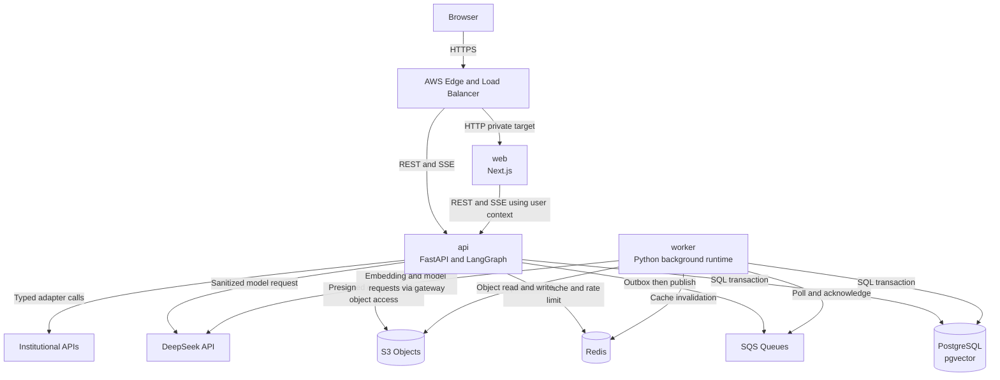

# ARCH-002 — C4 container view

## 1. Kiểu kiến trúc

V1 **MUST** là modular monolith ở mức code, triển khai bằng ba container image độc lập. “Container” trong tài liệu này theo nghĩa C4 logical/runtime container; deployment mapping nằm tại `ARCH-005`.

Kiến trúc này giảm số lượng distributed transaction, repository và pipeline cho một solo AI-assisted builder, đồng thời giữ ports, event và module boundaries để có thể tách service sau khi telemetry chứng minh cần thiết. Việc tách service chỉ được phép qua ADR mới.

## 2. Container diagram

## 3. Container catalog

| Container | Technology | Owner | Trách nhiệm | Không được sở hữu |
|---|---|---|---|---|
| `web` | Next.js/TypeScript | Web team | UI, SSR, accessibility, session presentation, API client, safe error rendering | Domain authorization, direct DB, provider key, durable workflow state |
| `api` | FastAPI/Python | Backend team | REST/SSE, auth context, authorization, domain services, transaction, request-time LangGraph, tool gateway | Long-running ingestion, direct provider-specific domain logic, local durable files |
| `worker` | Python | Backend/Platform team | SQS consumers, ingestion, embedding, outbox relay, notification dispatch, scheduled reconciliation | Public user API, independent business rules khác `api` |
| `postgres` | PostgreSQL + pgvector | Data owner | System of record, transaction, audit/outbox, FTS, vectors, LangGraph checkpoints | Blob nguyên bản lớn, transient rate-limit counters |
| `redis` | Redis-compatible managed cache | Platform | Rate limit, bounded distributed lock, short-lived cache, stream coordination where approved | Authoritative ticket, confirmation, consent, audit hoặc workflow state duy nhất |
| `object-store` | Amazon S3 | Knowledge owner | Original documents, normalized artifacts, exports, immutable evidence object | Relational state, executable secrets |
| `queue` | Amazon SQS | Platform | At-least-once job delivery, retry, DLQ | Business truth hoặc exactly-once guarantee |
| `llm-provider` | DeepSeek API | AI owner/vendor | Model inference only | Authorization, tool execution, memory authority, secret access |

## 4. Protocol và data ownership

| From | To | Protocol | Data class tối đa | Timeout/retry owner |
|---|---|---|---|---|
| Browser | `web`/`api` | TLS 1.2+, HTTPS/SSE | Theo endpoint; restricted only after auth | `api` contract |
| `web` | `api` | HTTPS REST/SSE | User-scoped | Web API client |
| `api`/`worker` | PostgreSQL | TLS SQL | Restricted | Repository layer |
| `api`/`worker` | Redis | TLS | Pseudonymous/ephemeral only | Cache adapter |
| `api` | SQS | AWS SDK via outbox relay | Event-minimized | Publisher |
| `worker` | SQS | Long polling | Event-minimized | Consumer |
| `api`/`worker` | S3 | AWS SDK, signed request | Knowledge/raw document | Object adapter |
| LLM gateway | DeepSeek | HTTPS/SSE | Sanitized payload only | LLM gateway |

## 5. Runtime invariants

1. `web` **MUST NOT** contain AWS, database hoặc DeepSeek credentials.
2. `api` and `worker` **MUST** share domain package versions from the same immutable build revision; they **MUST NOT** fork business rules.
3. Mỗi ECS task **SHOULD** chạy một application process; horizontal replication do orchestrator quản lý. FastAPI khuyến nghị container image tự xây thay vì deprecated base image, và replication có thể quản lý ở cluster/runtime layer ([FastAPI container deployment](https://fastapi.tiangolo.com/deployment/docker/)).
4. Container filesystem **MUST** được coi là ephemeral. Upload **MUST** chuyển vào object store trước khi báo durable.
5. Schema migration **MUST NOT** tự chạy đồng thời trong startup của mọi replica; migration là one-off deployment task với lock và rollback plan.
6. API response **MUST** có `correlation_id`; async event **MUST** mang `correlation_id` và `causation_id`.

## 6. Health contract

Mỗi runtime **MUST** cung cấp:

| Endpoint/check | Ý nghĩa | Dependency behavior |
|---|---|---|
| `/health/live` | Process event loop còn sống | Không gọi network dependency |
| `/health/ready` | Có thể nhận request mới | Kiểm tra bounded DB connectivity và required configuration; không gọi LLM |
| `/health/startup` | Startup/migration compatibility hoàn tất | Fail nếu schema/app version không tương thích |

Worker không public endpoint; ECS health check có thể dùng process command hoặc localhost-only health endpoint. LLM hoặc external integration lỗi **MUST NOT** làm `live` fail; chúng thay đổi capability/degradation status.

## 7. Scaling contract

- `web` và `api` phải stateless giữa request, ngoài state trong PostgreSQL/Redis.
- `worker` scale theo queue backlog; consumer idempotent.
- Số connection DB tối đa của một task **MUST** là cấu hình; tổng `max_tasks × pool_size + administrative_reserve` **MUST** nhỏ hơn DB connection budget.
- LangGraph checkpoint durable **MUST** dùng PostgreSQL-compatible saver ở production; in-memory saver chỉ được phép cho unit test/local demo.
- Next.js nhiều instance **MUST** có build ID nhất quán và strategy cho shared cache/tag invalidation; tài liệu Next.js nêu cache local không tự chia sẻ giữa nhiều instance ([Next.js self-hosting](https://nextjs.org/docs/app/guides/self-hosting)).

## 8. Failure behavior

| Failure | Container response |
|---|---|
| PostgreSQL unreachable | Write/read authoritative fail; ready false; không fallback Redis làm truth |
| Redis unreachable | Bypass non-security cache; rate-limit fail mode theo security policy; không mất domain state |
| SQS unavailable | Domain transaction vẫn commit cùng outbox; relay retry; backlog alarm |
| S3 unavailable | Ingestion/upload không hoàn tất; metadata ở trạng thái pending/failed |
| DeepSeek unavailable | Circuit opens; deterministic fallback; không retry vô hạn trong user request |
| Worker crash mid-message | Message xuất hiện lại sau visibility timeout; idempotent consumer tiếp tục |

## 9. Acceptance evidence

- Container dependency test chứng minh `web` không import backend/provider packages.
- Architecture test chứng minh domain layer không import infrastructure adapters.
- Smoke test chạy ba image bằng local compose với fake provider và synthetic data.
- Chaos test ngắt Redis nhưng ticket data vẫn đúng; ngắt SQS rồi khôi phục và outbox được drain.
- Evidence package ghi image digest, source revision, schema version và commands/exit codes.

## 10. Traceability và nguồn

- Upstream: `DEC-003`, `DEC-008`–`DEC-012`, `DEC-014`; `ASM-001`–`ASM-003`.
- ADR: `ADR-001`, `ADR-002`, `ADR-003`, `ADR-004`, `ADR-008`.
- Official references: [Amazon ECS](https://docs.aws.amazon.com/AmazonECS/latest/developerguide/), [FastAPI in Containers](https://fastapi.tiangolo.com/deployment/docker/), [Next.js Self-Hosting](https://nextjs.org/docs/app/guides/self-hosting), `SRC-LANGGRAPH-001`.

