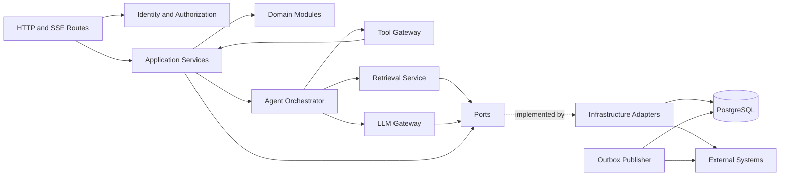

# ARCH-003 — Component view và dependency rules

## 1. Mục tiêu

Tài liệu này khóa module boundaries để coding agent không biến modular monolith thành một tập import vòng hoặc “service” tùy ý. Đường dẫn là target contract; task tạo scaffold phải dùng đúng tên hoặc mở change request trước khi đổi.

## 2. Logical component diagram



## 3. Source layout contract

```text
apps/
  web/                         # Next.js only
services/
  api/
    src/campus247/
      presentation/            # FastAPI routes, SSE serializers
      application/             # use cases, transactions, commands, queries
      domain/                  # entities, value objects, policies, domain events
      agent/                   # LangGraph graph and nodes
      ports/                   # protocols/interfaces; no provider implementation
      infrastructure/          # PostgreSQL, Redis, S3, SQS, HTTP adapters
      bootstrap/               # dependency injection and configuration
  worker/
    src/campus247_worker/      # consumers and schedules; imports approved shared packages
packages/
  contracts/                   # generated clients/schemas; no domain behavior
  prompts/                     # versioned prompt assets
  evals/                       # datasets and graders
```

Agent **MUST NOT** tạo một top-level service mới, đổi path hoặc di chuyển ownership chỉ để hoàn thành task nhỏ.

## 4. Bounded component catalog

| Component | Namespace đề xuất | Trách nhiệm duy nhất | Owns state | Allowed dependencies |
|---|---|---|---|---|
| Identity | `domain.identity` | Principal, role/claim mapping | User projection, role binding | Shared kernel only |
| Policy | `domain.policy` | Authorization decision, action risk | Policy version/decision record | Identity, shared kernel |
| Conversation | `domain.conversation` | Thread/message lifecycle | Conversation/message metadata | Identity |
| Knowledge | `domain.knowledge` | Source/version/chunk publication | Knowledge metadata, corpus version | Identity, audit |
| Retrieval | `application.retrieval` | Lexical/vector fusion, rerank, evidence | Retrieval run | Knowledge ports |
| Agent | `agent` | Controlled graph, routing, interrupts | Checkpoint reference | Application ports only |
| Action | `domain.action` | Preview, confirmation token, execution state | Action/confirmation/idempotency | Policy, audit |
| Ticket | `domain.ticket` | Ticket lifecycle and assignment | Ticket/events | Identity, action |
| Schedule | `domain.schedule` | Canonical read model | Optional sync projection | Identity, integration port |
| Document Request | `domain.document_request` | Request lifecycle | Request/events | Identity, action |
| Booking | `domain.booking` | Availability and reservation intent | Booking/events | Identity, action |
| HITL | `domain.handover` | Queue, handover package, resume | Handover/checkpoint link | Identity, conversation |
| Operations | `domain.operations` | Health/capability status and aggregate metrics | Operational config refs | Read-only domain projections |
| Audit | `domain.audit` | Append-only business audit API | Audit event | Shared kernel |
| Integration | `ports.integrations` | Canonical external contracts | None | Shared kernel |
| LLM Gateway | `ports.llm` + adapter | Provider-neutral inference | Request metadata/usage only | Prompt registry, policy |

## 5. Dependency direction

```text
presentation -> application -> domain
agent        -> application ports + domain value objects
worker       -> application commands
infrastructure -> implements ports
bootstrap    -> composes every layer
domain       -> Python standard library + explicitly approved pure libraries only
```

Rules:

1. Domain module **MUST NOT** import FastAPI, SQLAlchemy, LangGraph, Redis, AWS SDK hoặc DeepSeek client.
2. Route handler **MUST NOT** query ORM directly; nó gọi một application use case.
3. LangGraph node **MUST NOT** thực hiện SQL/HTTP trực tiếp; node gọi typed application port/tool.
4. Adapter response **MUST** được translated sang canonical DTO trước domain boundary.
5. Cross-domain write **MUST** đi qua public application command; không import repository của domain khác.
6. Shared kernel chỉ chứa IDs, timestamps, money-free common value types và error envelope; **MUST NOT** trở thành thư mục tiện ích hỗn hợp.

## 6. Transaction và event ownership

- Một application command **MUST** có một transaction boundary rõ.
- Domain change và outbox row liên quan **MUST** commit trong cùng PostgreSQL transaction.
- Domain event là fact quá khứ, dùng tên như `TicketCreated`; command dùng imperative như `CreateTicket`.
- Event handler **MUST NOT** thay đổi aggregate không thuộc mình bằng direct repository call; nó gửi application command cho owner.
- Cross-domain read có thể dùng query service hoặc explicit read model; không copy business rule.

## 7. Agent orchestration boundary

`agent` là workflow coordinator, không phải owner business state.

- Graph state **MUST** chứa ID/reference và output tối thiểu; không nhân bản toàn bộ authoritative record.
- Deterministic nodes **MUST** xử lý auth, policy, emergency rule, evidence gate và confirmation.
- LLM node chỉ đề xuất intent, query hoặc draft response theo schema.
- Tool execution **MUST** re-authorize tại thời điểm chạy, kể cả graph đã authorize trước đó.
- Node trước `interrupt` có side effect **MUST** idempotent vì resume có thể chạy lại; LangGraph mô tả persistence/checkpoint và yêu cầu lưu ý idempotency khi dùng interrupts (`SRC-LANGGRAPH-001`, `SRC-LANGGRAPH-002`).

## 8. Standard error contract

Mọi component error đi qua canonical envelope:

```json
{
  "error": {
    "code": "BOOKING_CONFLICT",
    "message_key": "booking.conflict",
    "retryable": false,
    "correlation_id": "01J...",
    "details": {}
  }
}
```

- `details` **MUST NOT** chứa stack trace, secret hoặc PII không cần thiết.
- Unknown exception **MUST** map thành `INTERNAL_ERROR`; log giữ exception với redaction.
- Agent **MUST NOT** parse human-readable message để quyết định control flow; dùng stable `code`.

## 9. Failure và stop rules cho coding agent

Agent **MUST** dừng và phát blocker nếu:

- task cần import ngược dependency direction;
- cần direct database access từ route hoặc graph node;
- cần sửa hơn một bounded context mà task không liệt kê;
- canonical port chưa tồn tại hoặc contract mâu thuẫn;
- cần tạo shared utility chứa logic domain;
- cần thêm side effect không có action/audit/idempotency design.

## 10. Acceptance evidence

- Automated import-boundary test theo namespace ở mục 3–5.
- Unit test domain không khởi tạo network/database framework.
- Contract test cho từng adapter và canonical DTO.
- Integration test chứng minh domain update + outbox rollback/commit cùng nhau.
- LangGraph test dùng fake LLM và fake tools, bao gồm interrupt/resume và duplicate resume.
- Dependency graph artifact không có cycle giữa bounded contexts.

## 11. Traceability

- Upstream: `DEC-008`, `DEC-011`, `DEC-014`, `DEC-015`, `DEC-017`–`DEC-020`.
- ADR: `ADR-001`, `ADR-003`, `ADR-006`, `ADR-007`, `ADR-008`.
- Downstream: detailed design, API/event/tool contract, architecture tests, atomic tasks.

