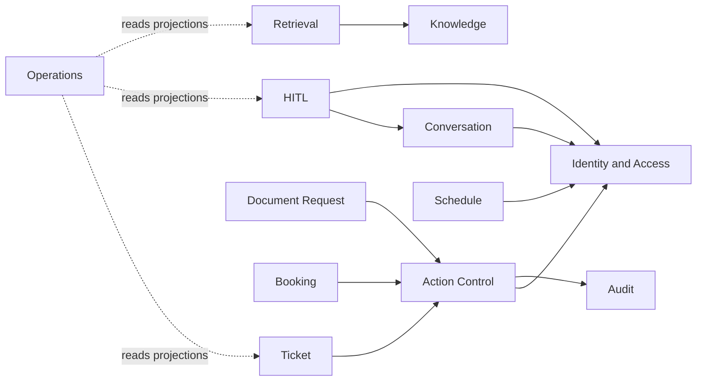
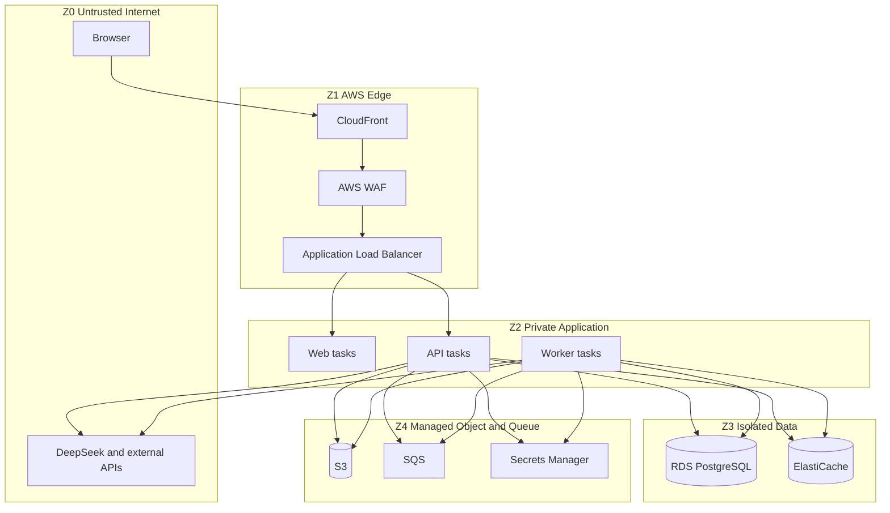

# ARCH-004 — Domain boundaries và trust boundaries

## 1. Nguyên tắc

Domain boundary xác định ai sở hữu business invariant; trust boundary xác định nơi dữ liệu chuyển sang mức tin cậy khác. Hai khái niệm **MUST NOT** bị trộn. Module ở cùng process vẫn phải tuân thủ domain boundary; traffic trong cùng VPC vẫn phải được coi là có thể bị giả mạo nếu thiếu identity và policy context.

## 2. Domain map

Mũi tên là dependency được phép, không cho phép truy cập bảng trực tiếp. Bất kỳ dependency mới nào **MUST** cập nhật diagram, bảng ownership và ADR nếu thay đổi cấu trúc đáng kể.

## 3. Aggregate và source of truth

| Domain | Aggregate root / canonical record | Writer duy nhất | Read sharing |
|---|---|---|---|
| Identity | `User`, `RoleBinding`, `IdentityLink` | Identity application service | Claims projection có expiry |
| Conversation | `Conversation`, `Message` | Conversation service | Agent/HITL qua query port |
| Knowledge | `KnowledgeSource`, `DocumentVersion`, `CorpusVersion` | Knowledge service | Retrieval read model |
| Retrieval | `RetrievalRun`, `Citation` | Retrieval service | Conversation/eval query |
| Action Control | `ActionPreview`, `Confirmation`, `ToolExecution` | Action service | Target domain nhận validated command |
| Ticket | `Ticket` + immutable `TicketEvent` | Ticket service | Staff queue projection |
| Schedule | `ScheduleSnapshot` hoặc external canonical DTO | Schedule sync/query service | Student self-service only |
| Document Request | `DocumentRequest` | Document request service | Student/staff query |
| Booking | `Booking` | Booking service | Availability projection |
| HITL | `HandoverCase` | Handover service | Staff queue + graph resume |
| Operations | `CapabilityState`, metric projection | Operations service | Admin-only aggregate view |
| Audit | `AuditEvent` append-only | Audit service API | Restricted audit query |

Quy tắc ownership:

- Một module **MUST NOT** update table thuộc module khác bằng ORM/repository nội bộ.
- Foreign key kỹ thuật không tạo quyền write. Cross-domain change dùng application command hoặc event.
- Reporting query **MAY** đọc approved projection/view; **MUST NOT** nhúng business decision vào SQL dashboard.
- Audit record **MUST** append-only ở application level; correction dùng compensating event, không update lịch sử.

## 4. Data classification tại boundary

Security package có thể tinh chỉnh nhưng không được hạ thấp các mức tối thiểu sau:

| Class | Ví dụ | Rule tối thiểu |
|---|---|---|
| `PUBLIC` | Tài liệu công khai đã duyệt, static assets | Có thể CDN cache theo version; vẫn phải giữ provenance |
| `INTERNAL` | Cấu hình không bí mật, taxonomy, aggregate metrics | Authenticated staff hoặc service identity |
| `CONFIDENTIAL` | Nội dung ticket, lịch cá nhân, transcript đã redacted | Encrypt in transit/at rest; need-to-know; không shared cache |
| `RESTRICTED` | Identity link, contact detail, sensitive case, secret, raw audit | Least privilege; field-level redaction; explicit audit; không gửi LLM mặc định |

Agent **MUST** chọn mức cao hơn khi không chắc chắn và phát blocker cho Privacy/Security owner; **MUST NOT** tự hạ classification để gọi provider.

## 5. Trust zones

## 6. Boundary controls

| Crossing | Authentication | Authorization | Validation | Data minimization | Audit |
|---|---|---|---|---|---|
| Browser → edge/app | Session/OIDC-derived token; CSRF control where cookie used | Endpoint + object-level | Size, type, schema, content | Chỉ field endpoint cần | Login, denied action, write |
| Web → API | Forward verified session context; no client-asserted role | Recomputed by API | Contract schema | Không forward browser-only state | Correlation ID |
| API/worker → DB | IAM/network + DB role/secret | Schema/table grants and app policy | Parameterized query | Chỉ selected columns | DB/application audit |
| API/worker → S3 | Task role, signed AWS request | Bucket/key prefix policy | MIME, checksum, malware state | Presigned scope tối thiểu | Object access/write |
| API → integration | Per-adapter credential | Capability allowlist | Response schema + semantic checks | Canonical required fields | Request metadata, result code |
| Gateway → LLM | Provider credential chỉ trong adapter | Model/tool/prompt policy | Request/output JSON schema | Redact/drop identifiers | Usage, policy, model version; không log raw prompt mặc định |
| SQS → worker | Task role + queue policy | Consumer allowlist | Event envelope/schema/version | Event reference thay raw payload | Receive/result/DLQ |

## 7. Model và document là untrusted

- Prompt, retrieved chunk, uploaded document và model output đều là untrusted data.
- Retrieved content **MUST** được đặt trong data channel rõ ràng; **MUST NOT** được nối vào system instruction như instruction mới.
- Tool names và schemas do server registry cấp; model **MUST NOT** tạo dynamic URL, SQL hoặc code để thực thi.
- Model arguments **MUST** được parse và validate; DeepSeek official API cũng cảnh báo function arguments có thể không hợp lệ hoặc chứa tham số hallucinated ([DeepSeek Responses API](https://api-docs.deepseek.com/api/create-response/)).
- Document upload **MUST** đi qua scan, parser sandbox/limits, provenance và approval trước publish.

## 8. Single-institution invariant

V1 **MUST NOT** thêm `tenant_id` vào mọi bảng, tenant middleware, tenant billing hoặc cross-tenant abstraction. Institution-level branding/configuration có thể là single deployment config. Nếu tương lai chuyển SaaS, phải có ADR mới, threat model và migration; không được tuyên bố hiện tại “multi-tenant ready”.

## 9. Failure behavior

| Control failure | Required behavior |
|---|---|
| Không xác định data class | Dừng outbound transfer; classify cao hơn; escalate |
| Missing object authorization context | `403` hoặc `401`; không query rồi lọc ở client |
| Audit unavailable cho sensitive write | Fail closed trước side effect |
| Provider asks for extra field | Adapter bỏ field; không tự mở rộng payload |
| Schema validation fails | Quarantine/reject response; không pass raw vào domain |
| Document scan/provenance fail | Giữ `QUARANTINED`; không index/publish |

## 10. Acceptance evidence và traceability

Required evidence:

- Data-flow diagram mapping từng field class qua boundary.
- Authorization tests cho object-level access và role combinations.
- Static test chặn direct repository import xuyên domain.
- Provider request fixture chứng minh không có direct identifier/secret.
- Upload test chứng minh quarantined document không vào active corpus.

Traceability: `DEC-001`, `DEC-004`, `DEC-006`–`DEC-008`, `DEC-013`–`DEC-016`; `OQ-002`, `OQ-005`–`OQ-007`; `ARCH-003`, `ARCH-005`, `ARCH-008`; `SRC-AWS-003`, `SRC-OWASP-001`.

