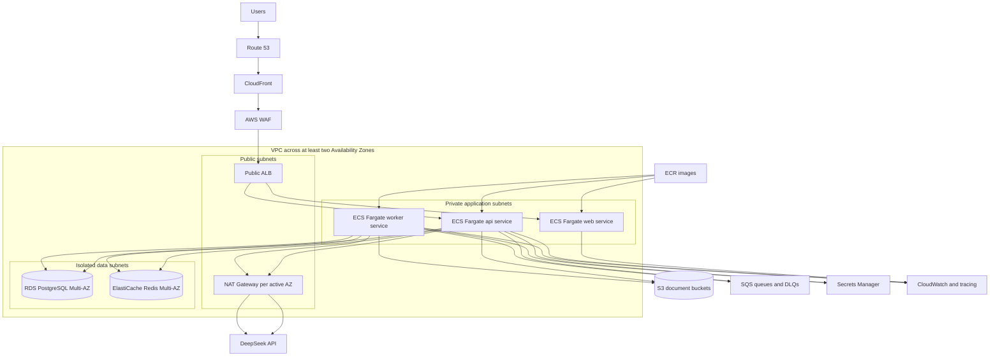

# ARCH-005 — AWS deployment topology

## 1. Deployment decision

Production baseline dùng Amazon ECS on Fargate, không dùng Kubernetes. ECS cung cấp orchestration và Fargate loại bỏ quản lý host; ECS Service Auto Scaling có thể scale task theo CloudWatch metrics hoặc SQS backlog ([ECS overview](https://docs.aws.amazon.com/AmazonECS/latest/developerguide/), [ECS service auto scaling](https://docs.aws.amazon.com/AmazonECS/latest/developerguide/service-auto-scaling.html)). EKS/Kubernetes chỉ được xem lại khi có yêu cầu tổ chức hoặc workload không đáp ứng được bằng ECS, qua ADR mới và cost/operations review.

`ap-southeast-1` chỉ là region cho simulated reference deployment theo `DEC-010`. Real personal data **MUST NOT** được triển khai cho đến khi `OQ-005` và yêu cầu data residency/cross-border được phê duyệt.

## 2. Production topology



## 3. Network rules

1. Chỉ CloudFront/approved edge path được gọi ALB khi cấu hình kỹ thuật hỗ trợ; origin protection **MUST** được kiểm thử.
2. ECS tasks **MUST** ở private subnets và **MUST NOT** có public IP.
3. RDS và ElastiCache **MUST** ở isolated/private data subnets, không có route trực tiếp tới Internet.
4. Security group **MUST** tham chiếu security group nguồn, không dùng broad CIDR cho app-to-data.
5. Worker **MUST NOT** có inbound listener từ Internet/ALB.
6. Egress **MUST** được giới hạn theo capability; direct arbitrary URL fetch từ model/user input bị cấm.
7. VPC endpoints cho S3, ECR, CloudWatch/Logs, Secrets Manager và SQS **SHOULD** được đánh giá để giảm NAT exposure/cost; exact set phải qua cost review.

## 4. Edge và routing

- Route 53 quản lý DNS; ACM quản lý TLS certificate.
- CloudFront phục vụ versioned static assets và chuyển dynamic request đến ALB.
- WAF áp dụng managed baseline, request-size/rate rules và exception có version.
- ALB route `/api/*`, `/health/*` và SSE endpoint tới `api`; route còn lại tới `web`.
- Dynamic/authenticated/SSE behavior **MUST** disable shared caching. Static immutable asset dùng content hash.
- SSE **MUST** phát heartbeat nhỏ hơn configured idle timeout; ALB mặc định có idle timeout 60 giây và cho phép cấu hình attribute này ([ALB attributes](https://docs.aws.amazon.com/elasticloadbalancing/latest/application/edit-load-balancer-attributes.html)). Giá trị cuối phải được load test; agent không được hard-code mà không có config/test.

## 5. Compute

| ECS service/task | Minimum production desired count | Placement | Scaling signal | Deployment |
|---|---:|---|---|---|
| `web` | 2 | Ít nhất 2 AZ | CPU, memory, request count | Rolling hoặc blue/green theo release plan |
| `api` | 2 | Ít nhất 2 AZ | CPU, memory, ALB latency/request | Rolling; graceful SSE drain |
| `worker` | 2 tổng hoặc 1 mỗi queue class sau test | Ít nhất 2 AZ khi count ≥2 | SQS backlog/age + CPU | Rolling; visibility-aware shutdown |
| `migration` | 0 steady; one-off task | Private subnet | Không autoscale | Chạy trước app rollout qua gated job |

- Image **MUST** lưu trong ECR, pin bằng digest ở production.
- Task role và execution role **MUST** tách; mỗi service dùng least privilege riêng.
- Runtime config không bí mật có version; secret ở Secrets Manager. Nếu inject secret lúc task start, rotation không tự cập nhật task đang chạy, vì vậy pipeline **MUST** force new deployment hoặc ứng dụng dùng retrieval/refresh pattern phù hợp ([ECS Secrets Manager guidance](https://docs.aws.amazon.com/AmazonECS/latest/developerguide/secrets-envvar-secrets-manager.html)).

## 6. Data services

### 6.1 PostgreSQL

- Production **MUST** dùng RDS PostgreSQL Multi-AZ; RDS tự động failover sang standby trong failure conditions nhưng application vẫn phải reconnect/retry bounded ([RDS Multi-AZ](https://docs.aws.amazon.com/AmazonRDS/latest/UserGuide/Concepts.MultiAZSingleStandby.html)).
- Selected engine version **MUST** được pin và kiểm tra pgvector availability/version trước deploy; AWS công bố extension matrix riêng và extension không tự nâng cùng engine ([RDS PostgreSQL extensions](https://docs.aws.amazon.com/AmazonRDS/latest/PostgreSQLReleaseNotes/postgresql-extensions.html)).
- Automated backup, point-in-time recovery, encryption bằng KMS và deletion protection **MUST** bật cho production.
- Connection pool budget và migration compatibility gate **MUST** có automated check.

### 6.2 Redis

- Production **MUST** dùng ElastiCache replication group có Multi-AZ và automatic failover nếu Redis nằm trên critical request path. AWS khuyến nghị Multi-AZ để tự failover replica khi primary lỗi ([ElastiCache resilience](https://docs.aws.amazon.com/AmazonElastiCache/latest/dg/disaster-recovery-resiliency.html)).
- Redis data **MUST** được coi là mất được; authoritative state vẫn ở PostgreSQL.
- Encryption in transit, at rest và auth token/IAM mechanism supported **MUST** được bật theo selected engine.

### 6.3 S3 và SQS

- Bucket public access block, versioning, encryption, lifecycle và distinct raw/processed/export prefix **MUST** có IaC test.
- SQS queue **MUST** có DLQ, retention, visibility timeout lớn hơn p99 processing hoặc có heartbeat extension, và redrive procedure.
- Standard queue là at-least-once; consumer **MUST** idempotent. Không được tuyên bố exactly-once chỉ nhờ queue.

## 7. Environment/account model

| Environment | AWS boundary | Data | HA expectation | External LLM |
|---|---|---|---|---|
| `local` | Developer machine/Compose | Synthetic seed | Không | Fake mặc định |
| `development` | Non-production AWS account | Synthetic | Cost-optimized; single instance được phép | Fake; DeepSeek opt-in gated |
| `staging` | Non-production AWS account, isolated namespace/VPC | Synthetic production-scale | Production-like | DeepSeek test key nếu được duyệt |
| `production` | Separate AWS account | Chỉ sau legal/data approval | Multi-AZ baseline | Chỉ approved contract/config |

Secrets, database, bucket và identity config **MUST NOT** dùng chung giữa môi trường. Production account access **MUST** dùng short-lived identity và audit; không dùng access key cá nhân dài hạn.

## 8. Infrastructure as code và deploy order

AWS CDK bằng TypeScript là IaC baseline đề xuất trong `ADR-014`; generated CloudFormation phải review được. Deploy order:

```text
network/security baseline
-> data and queue resources
-> schema compatibility check/migration task
-> worker services
-> api service
-> web service
-> smoke tests
-> traffic promotion
```

Pipeline **MUST** stop trước paid resource, production deploy hoặc destructive replacement nếu chưa có human approval theo `DEC-020`.

## 9. Failure and recovery

| Failure | Detection | Automatic behavior | Human action |
|---|---|---|---|
| One ECS task | ECS/ALB health | Replace task; other replicas serve | Investigate repeated crash |
| One AZ | Service/RDS/cache events | Multi-AZ targets continue/fail over | Validate capacity and incident |
| DB failover | Connection errors + RDS event | Bounded reconnect with jitter | Confirm integrity/backlog |
| Region outage | External synthetic monitor | No automatic cross-region write failover in V1 | Invoke DR/runbook; restore in approved region |
| Provider outage | Gateway circuit/metrics | `DEGRADED_NO_LLM` | Switch approved provider only through config/change gate |
| Bad release | SLO/error alarms | Stop rollout | Roll back image; forward-fix schema if irreversible |

Multi-region active-active **MUST NOT** được xây trong V1. RPO 15 phút/RTO 60 phút (`ASM-006`) phải được chứng minh bằng backup/restore drill; topology diagram không tự chứng minh SLO.

## 10. Acceptance evidence và blockers

Required evidence:

- Synth/IaC diff không có public ECS/RDS/Redis và không có `0.0.0.0/0` tới data port.
- Two-AZ failure test cho web/API; controlled RDS/Redis failover test ở staging.
- Restore drill đo RPO/RTO, checksum và application smoke test.
- Load test theo `ASM-001`/`ASM-002`, bao gồm SSE và queue backlog.
- Cost estimate và budget alarms ở 50/75/90% mức được duyệt.
- ECR image scan, SBOM, immutable digest và rollback evidence.

Production blockers: `OQ-005` (external LLM/legal), `OQ-008` (budget), cùng owner/identity/integration questions liên quan. Nếu chưa đóng, deploy production **MUST** bị chặn.

## 11. Traceability

- Upstream: `DEC-003`, `DEC-009`–`DEC-011`, `DEC-020`; `ASM-001`–`ASM-003`, `ASM-006`; `OQ-005`, `OQ-008`.
- ADR: `ADR-002`, `ADR-004`, `ADR-008`, `ADR-012`, `ADR-014`.
- Downstream: platform IaC, SLO, observability, release and DR runbooks.

