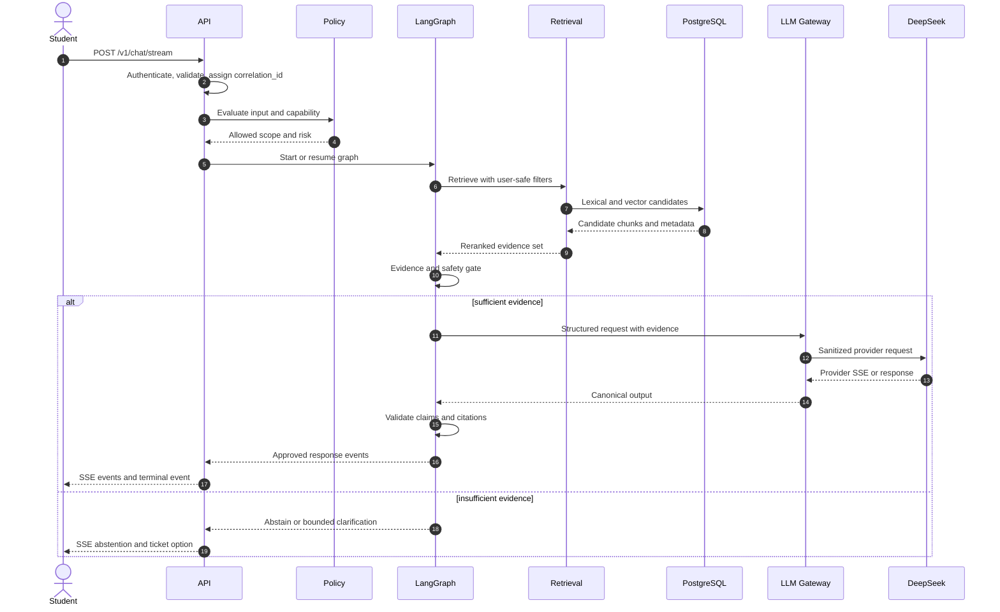
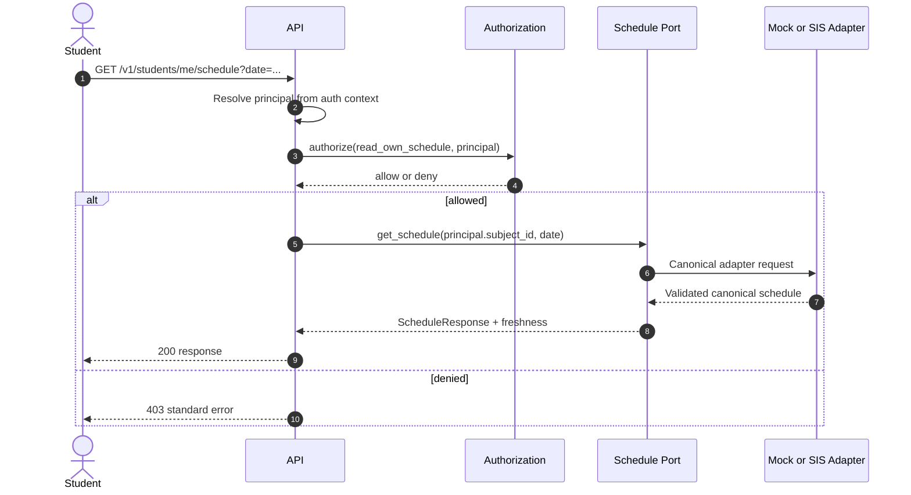
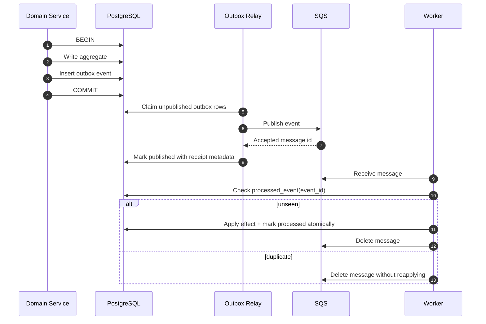
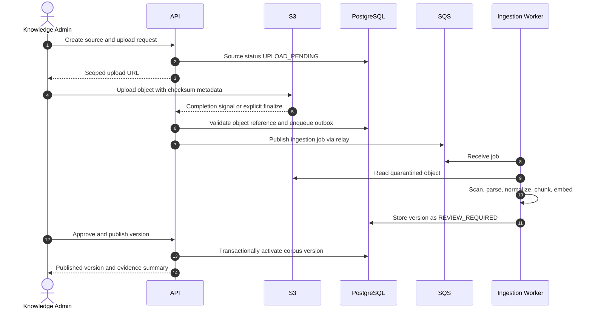

# ARCH-006 — Request và event flows

## 1. Quy ước chung

Mọi inbound request **MUST** có hoặc được cấp `correlation_id`. Mọi state-changing command **MUST** có `idempotency_key`. Mọi event **MUST** có `event_id`, `correlation_id`, `causation_id`, `schema_version`, `occurred_at`, `producer` và payload tối thiểu.

API sử dụng REST/JSON cho command/query, SSE cho chat stream một chiều. WebSocket **MUST NOT** được thêm nếu chưa có use case hai chiều và ADR mới.

## 2. Grounded chat flow



Rules:

- API **MUST NOT** stream raw provider reasoning, provider error hoặc unvalidated citation.
- Client disconnect **MUST** cancel downstream work where safe; persisted conversation state must remain consistent.
- Terminal event **MUST** be exactly one of `response.completed`, `response.incomplete`, `response.failed` in Campus canonical SSE contract, independent of provider naming.
- Citation validation occurs before final user-visible completion.

## 3. Read-only personal data flow



Any student identifier supplied by client **MUST** be ignored/rejected for “me” endpoint. Cache key, nếu có, **MUST** include opaque subject scope and TTL/freshness; shared/public cache is forbidden.

## 4. Write action preview và confirmation

```mermaid
sequenceDiagram
    autonumber
    actor U as Student
    participant A as API
    participant P as Policy
    participant AC as Action Control
    participant T as Target Domain
    participant DB as PostgreSQL

    U->>A: POST /v1/actions/preview
    A->>P: authorize and assess risk
    P-->>A: policy_decision_id and constraints
    A->>AC: create_preview(actor, normalized_payload)
    AC->>DB: Store preview hash, expiry, policy version
    DB-->>AC: action_id and confirmation_token
    AC-->>U: Human-readable preview
    U->>A: POST /v1/actions/{id}/confirm + Idempotency-Key
    A->>AC: verify actor, token, expiry, payload hash
    AC->>P: re-authorize current state
    P-->>AC: allow or deny
    alt allowed and not executed
        AC->>T: execute canonical command
        T->>DB: Domain change + audit + outbox in one transaction
        DB-->>T: committed result
        T-->>AC: execution result
        AC-->>U: success and resource reference
    else duplicate key
        AC-->>U: original stored result
    else expired, changed, or denied
        AC-->>U: conflict or forbidden; create new preview if appropriate
    end
```

Preview token **MUST** bind `actor_id`, `action_type`, normalized payload hash, policy decision/version, expiry và nonce. Confirmation **MUST NOT** accept mutable payload khác preview. Retry cùng key trả cùng result hoặc trạng thái đang xử lý; **MUST NOT** tạo side effect thứ hai.

## 5. Transactional outbox và async consumer



Transactional outbox tránh dual-write inconsistency; AWS guidance cũng yêu cầu consumer idempotent vì duplicate có thể xảy ra ([AWS transactional outbox pattern](https://docs.aws.amazon.com/en_en/prescriptive-guidance/latest/cloud-design-patterns/transactional-outbox.html)).

### 5.1 Canonical event envelope

```json
{
  "event_id": "01J...",
  "event_type": "TicketCreated",
  "schema_version": "1.0",
  "occurred_at": "2026-09-21T10:00:00Z",
  "producer": "ticket",
  "correlation_id": "01J...",
  "causation_id": "01J...",
  "aggregate": {"type": "Ticket", "id": "TKT_...", "version": 1},
  "data": {"priority": "NORMAL", "queue_id": "student-affairs"}
}
```

Event **MUST NOT** chứa full transcript, secret, raw model prompt hoặc object nhạy cảm khi consumer chỉ cần ID/reference. Schema breaking change phải tăng major và có consumer migration.

## 6. Knowledge ingestion/publish flow



Ingestion success **MUST NOT** tự publish. Publish requires authorized knowledge admin, provenance, effective dates, checksum, scan status và validation/eval gate.

## 7. HITL interrupt/resume

1. Graph creates `HandoverCase` and persists checkpoint reference.
2. User receives case ID and realistic service message; no promise beyond approved SLA.
3. Staff opens case under queue/object authorization and records a resolution/decision.
4. Resume command validates case state, actor and checkpoint version.
5. Graph resumes with typed staff outcome, not free-form instruction with system privilege.
6. Duplicate resume returns the stored outcome; closed/expired case cannot run tool again.

LangGraph checkpointers support thread-scoped persistence/resume, and interrupt/resume may restart code around the interruption; side effects must therefore be isolated/idempotent (`SRC-LANGGRAPH-001`, `SRC-LANGGRAPH-002`).

## 8. Timeout, retry và cancellation policy

| Operation | User-request retry | Worker retry | Failure result |
|---|---|---|---|
| PostgreSQL transaction | Bounded only for transient serialization/connect errors | Same, idempotent | Retryable 503 or queue retry |
| Redis cache | No retry storm; short timeout | Short bounded | Bypass cache/degrade |
| LLM call | At most policy-defined bounded retry before first streamed content | Bounded by job budget | Abstain or DLQ |
| External read | Bounded exponential backoff with jitter | Bounded | Unavailable + freshness |
| External write | Only with idempotency key and provider support/reconciliation | Bounded | `UNKNOWN_REQUIRES_RECONCILIATION`, never false success |
| SQS consumer | Not applicable | Visibility timeout/redrive | DLQ after configured max receives |

Agent **MUST NOT** retry validation, authorization, conflict hoặc quota errors as transient.

## 9. Acceptance evidence

- Sequence-level integration tests for all flows above, including duplicate confirmation and duplicate SQS delivery.
- SSE contract test for ordering, heartbeat, terminal event and client disconnect.
- Outbox test for crash after DB commit/before publish and crash after publish/before mark.
- Ingestion test proving quarantine cannot be retrieved.
- HITL test proving duplicate resume cannot repeat side effect.
- Trace sample joining request, outbox event, worker execution and final resource by correlation ID.

## 10. Traceability

- Upstream: `DEC-012`–`DEC-016`; `ASM-008`, `ASM-009`.
- ADR: `ADR-005`, `ADR-006`, `ADR-008`, `ADR-009`, `ADR-010`.
- Downstream: OpenAPI, JSON Schema event registry, tool contracts, integration/e2e tests.

