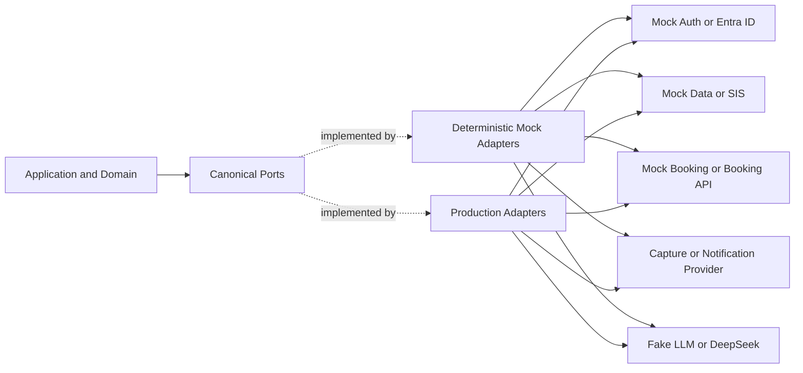
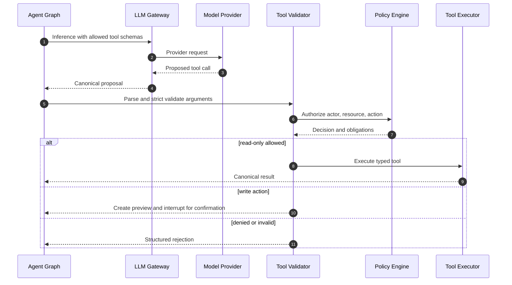

# ARCH-008 — Integration adapter và LLM gateway boundaries

## 1. Mục tiêu

Mọi dependency bên ngoài phải đứng sau canonical port để domain không phụ thuộc vendor, mock hoặc wire format. DeepSeek là provider đầu tiên nhưng **MUST NOT** trở thành domain abstraction.

## 2. Ports and adapters pattern



Dependency injection chọn adapter bằng validated environment config. User input hoặc model output **MUST NOT** chọn adapter/provider/endpoint.

## 3. Canonical port contract

Mỗi port **MUST** định nghĩa:

- typed request/response;
- authentication mechanism outside domain model;
- timeout, retryable error taxonomy và rate-limit semantics;
- idempotency capability cho write;
- freshness/source metadata cho read;
- health/capability check;
- redaction và audit policy;
- contract-test fixture dùng chung cho mock và production adapter.

Ví dụ type-level intent:

```python
class SchedulePort(Protocol):
    async def get_student_schedule(
        self,
        *,
        subject_ref: SubjectRef,
        date_range: DateRange,
        correlation_id: CorrelationId,
    ) -> ScheduleResult: ...

class BookingPort(Protocol):
    async def create_booking(
        self,
        *,
        command: AuthorizedBookingCommand,
        idempotency_key: IdempotencyKey,
    ) -> BookingResult: ...
```

Đây là interface design, không phải implementation task. Agent **MUST NOT** thêm optional `dict[str, Any]` để né contract.

## 4. Adapter catalog

| Port | Demo adapter | Future production adapter | Fail behavior |
|---|---|---|---|
| `IdentityPort` | `MockIdentityAdapter` với signed synthetic session | `EntraOidcAdapter` | Fail closed; no anonymous fallback |
| `SchedulePort` | Seeded deterministic schedule | Approved SIS API | Return unavailable/freshness; never fabricate |
| `BookingPort` | Transactional internal simulator | Approved room API | Conflict/unknown state explicit |
| `NotificationPort` | Capture-to-database/test mailbox | Email/SMS provider | Async retry + DLQ |
| `ObjectScanPort` | Deterministic safe/unsafe fixtures | Approved malware scanner | Quarantine on error |
| `EmbeddingPort` | Deterministic fake vector | Approved embedding model | Ingestion fails pending; no zero vector fallback |
| `LLMPort` | Scripted deterministic fake | DeepSeek adapter | Gateway degradation; no direct SDK in domain |

Mock adapter **MUST** simulate success, timeout, rate limit, malformed response, duplicate, conflict và unknown outcome. “Always success” mock là không đạt.

## 5. Anti-corruption layer

Production adapter **MUST**:

1. map canonical request sang vendor request;
2. validate vendor response bằng strict schema;
3. normalize timezone, identifiers, enum và errors;
4. attach source/freshness/provenance;
5. return canonical result only;
6. log metadata đã redacted và metric;
7. keep raw payload only if retention/security policy explicitly permits.

Domain **MUST NOT** branch theo HTTP status/provider-specific error; adapter map sang stable codes như `UPSTREAM_TIMEOUT`, `UPSTREAM_RATE_LIMITED`, `CONFLICT`, `UNKNOWN_OUTCOME`, `INVALID_UPSTREAM_RESPONSE`.

## 6. LLM gateway boundary

### 6.1 Responsibilities

`LLMGateway` **MUST** chịu trách nhiệm:

- model/provider routing từ server config;
- prompt/template version resolution;
- payload minimization/redaction;
- token/input/output budgets;
- tool allowlist và JSON Schema;
- timeout, rate limit, circuit breaker;
- streaming normalization;
- structured-output validation;
- usage/cost metadata và audit-safe telemetry;
- deterministic fake implementation cho test.

Gateway **MUST NOT** quyết định domain authorization hoặc tự thực thi tool.

### 6.2 Canonical request

```json
{
  "request_id": "01J...",
  "purpose": "GROUNDED_ANSWER",
  "prompt_version": "answer.vi.v1",
  "messages": [
    {"role": "user", "content": [{"type": "text", "text": "..."}]}
  ],
  "evidence": [
    {"chunk_id": "CHK_...", "document_version_id": "DOCV_...", "text": "..."}
  ],
  "tools": [],
  "output_schema_id": "GroundedAnswer.v1",
  "limits": {"max_output_tokens": 1200, "deadline_ms": 15000},
  "privacy": {"contains_direct_identifier": false, "classification": "INTERNAL"}
}
```

Mọi field phải có max size/count trong JSON Schema chi tiết. `privacy.contains_direct_identifier=true` **MUST** bị chặn với external provider cho đến khi `OQ-005` được phê duyệt và policy cho phép.

### 6.3 Canonical response

```json
{
  "request_id": "01J...",
  "provider": "deepseek",
  "provider_model": "configured-at-runtime",
  "status": "COMPLETED",
  "output": {
    "answer": "...",
    "citation_refs": ["CHK_..."],
    "proposed_tool_calls": []
  },
  "usage": {"input_tokens": 0, "output_tokens": 0},
  "validation": {"schema_valid": true, "policy_valid": true}
}
```

Provider model name **MUST** là config, không hard-code vào domain/test expectation. DeepSeek Responses API hiện mô tả stateless request, JSON Schema output, tools và semantic SSE; gateway phải normalize thay vì rò rỉ provider semantics ra ngoài ([DeepSeek Responses API](https://api-docs.deepseek.com/api/create-response/)).

## 7. Tool proposal versus execution



Model chỉ **propose**. `ToolExecutor` lấy actor từ trusted context, không từ model arguments. Tool registry **MUST** deny unknown tool/field; schema setting “additional properties” phải false khi format hỗ trợ.

## 8. Prompt và context boundaries

- System/developer instructions do server-owned prompt registry cung cấp và version hóa.
- Retrieved chunks nằm trong evidence collection với provenance; không concatenate như trusted instruction.
- Conversation history được chọn bằng explicit policy/retention; không gửi toàn bộ mặc định.
- Raw chain-of-thought/reasoning **MUST NOT** được lưu/hiển thị. Chỉ lưu output cần thiết, usage và decision metadata.
- Secret, access token, session cookie, database key, internal stack trace **MUST NOT** xuất hiện trong prompt.
- Provider `user` identifier, nếu dùng, phải là pseudonymous opaque value; DeepSeek docs explicitly yêu cầu không đặt privacy information trong field này ([DeepSeek Responses API](https://api-docs.deepseek.com/api/create-response/)).

## 9. Provider configuration

```yaml
llm:
  provider: "deepseek"
  base_url_secret_ref: "..."
  api_key_secret_ref: "..."
  model: "runtime-configured"
  timeout_ms: 15000
  max_attempts: 2
  max_parallel_requests: 20
  data_policy: "NO_DIRECT_IDENTIFIERS"
```

Example values are non-production. Secret reference **MUST** resolve server-side. Configuration change phải audit và model/prompt change phải chạy eval gate trước promotion.

## 10. Unknown external write outcome

Nếu timeout xảy ra sau khi request write đã rời hệ thống:

1. adapter trả `UNKNOWN_OUTCOME`, không trả fail/success giả;
2. domain lưu operation với idempotency key và reconciliation status;
3. worker query provider status bằng external reference/idempotency key nếu API hỗ trợ;
4. nếu không thể reconcile, handover cho staff;
5. **MUST NOT** gửi lại write trừ khi contract bảo đảm idempotency.

## 11. Acceptance evidence

- Shared contract suite pass cho fake và mỗi adapter production.
- Snapshot của outbound DeepSeek request chứng minh redaction, limits và tool allowlist.
- Tests cho malformed JSON, hallucinated field/tool, timeout, rate limit và stream interruption.
- Test chứng minh đổi fake ↔ DeepSeek chỉ qua composition/config, không sửa domain.
- Test chứng minh tool proposal không thể bypass authorization/confirmation.
- Cost/usage telemetry có provider/model/prompt version nhưng không chứa raw PII.

Nếu provider terms, retention hoặc personal-data transfer chưa được phê duyệt (`OQ-005`), external LLM adapter **MUST** disabled ngoài synthetic environment.

## 12. Traceability

- Upstream: `DEC-004`, `DEC-007`, `DEC-008`, `DEC-013`–`DEC-016`; `OQ-004`, `OQ-005`, `OQ-007`.
- ADR: `ADR-006`, `ADR-007`, `ADR-009`.
- Sources: `SRC-DEEPSEEK-001`, `SRC-DEEPSEEK-002`, `SRC-LANGGRAPH-001`, `SRC-LANGGRAPH-002`, `SRC-OWASP-001`.

