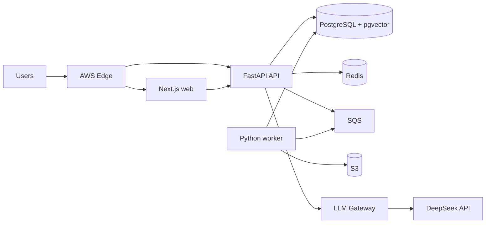

# Architecture package index

## 1. Mục đích và trạng thái

Thư mục này là nguồn thiết kế kiến trúc cấp cao cho Campus 24/7. Bộ tài liệu mô tả hệ thống thương mại cho **một trường duy nhất**, với `HUCE Demo` là dữ liệu mô phỏng. Đây là tài liệu thiết kế, không phải tuyên bố rằng Đại học Xây dựng đã phê duyệt hoặc vận hành sản phẩm.

Bộ tài liệu kiến trúc (ARCH-001 đến ARCH-009) đã được Architecture Lead và các bên liên quan phê duyệt chính thức (`status: approved`) cho phạm vi triển khai mô phỏng dữ liệu tổng hợp (synthetic implementation) ngày 2026-09-22 theo quyết định của `TASK-DOC-ARCH-001`. Triển khai production và tích hợp thật tiếp tục bị chặn bởi OQ-001..OQ-008.

## 2. Thứ tự đọc bắt buộc

Implementation agent **MUST** đọc theo thứ tự sau trước khi thay đổi code liên quan:

1. `docs/README.md` và toàn bộ `docs/00-governance/**`.
2. Tài liệu ARCH trong bảng dưới theo thứ tự ID.
3. ADR được tài liệu ARCH tham chiếu.
4. Requirement, contract, security control và atomic task tương ứng.

| Document | Phạm vi | ID chính |
|---|---|---|
| `ARCH-001_SYSTEM_CONTEXT.md` | Bối cảnh, actor, hệ thống ngoài, phạm vi | `ARCH-001` |
| `ARCH-002_CONTAINER_VIEW.md` | C4 container và trách nhiệm runtime | `ARCH-002` |
| `ARCH-003_COMPONENT_VIEW.md` | Thành phần API/worker, luật phụ thuộc | `ARCH-003` |
| `ARCH-004_DOMAIN_AND_TRUST_BOUNDARIES.md` | Bounded context, dữ liệu và trust zone | `ARCH-004` |
| `ARCH-005_DEPLOYMENT_TOPOLOGY.md` | Topology AWS và môi trường | `ARCH-005` |
| `ARCH-006_REQUEST_AND_EVENT_FLOWS.md` | Luồng đồng bộ, bất đồng bộ, idempotency | `ARCH-006` |
| `ARCH-007_RELIABILITY_SCALABILITY_CACHING.md` | Degradation, tải và cache | `ARCH-007` |
| `ARCH-008_INTEGRATION_AND_LLM_BOUNDARIES.md` | Adapter và LLM gateway | `ARCH-008` |
| `ARCH-009_CONFORMANCE_AND_TRACEABILITY.md` | Quy tắc thực thi và bằng chứng | `ARCH-009` |

ADRs nằm tại `docs/04-architecture/adr/**`. Mỗi ADR có trạng thái quyết định riêng. Agent **MUST NOT** thực thi ADR ở trạng thái `proposed`, `rejected` hoặc `superseded`.

## 3. Kiến trúc tóm tắt

Baseline là modular monolith được đóng gói thành ba runtime độc lập:

- `web`: Next.js cho UI và server-side rendering.
- `api`: FastAPI cho REST, SSE, authorization, domain transaction và LangGraph request-time.
- `worker`: FastAPI-compatible Python application không public HTTP, xử lý ingestion, outbox và job bất đồng bộ.

PostgreSQL + pgvector là system of record; Redis chỉ giữ trạng thái ngắn hạn có thể tái tạo; S3 giữ object; SQS chuyên chở job at-least-once. DeepSeek chỉ được gọi qua `LLMGateway`.

## 4. Quy tắc toàn cục cho implementation agent

1. Agent **MUST** giữ một thay đổi trong đúng bounded context và layer được task cho phép.
2. Agent **MUST NOT** thêm network path, datastore, provider SDK hoặc background channel chưa có ADR `accepted`.
3. Agent **MUST NOT** cho model truy cập database, S3, Redis hoặc integration credential trực tiếp.
4. Agent **MUST NOT** dùng Redis làm system of record hoặc lưu dữ liệu duy nhất tại local container filesystem.
5. Mọi write action **MUST** đi qua authorization, validation, preview, confirmation, idempotency và audit.
6. Mọi SQS consumer **MUST** idempotent; duplicate delivery là hành vi bình thường.
7. Dữ liệu cá nhân **MUST NOT** đi vào CDN cache, shared Next.js cache, retrieval cache hoặc log.
8. Nếu requirement, contract và architecture không thống nhất, agent **MUST** dừng và trả blocker; precedence nằm trong `docs/README.md`.

## 5. Điều kiện chấp nhận bộ kiến trúc

Reviewer chỉ chuyển bộ tài liệu sang `approved` khi có bằng chứng:

- Tất cả Mermaid block parse thành công.
- Không trùng `ARCH-*` hoặc `ADR-*` ID.
- Mọi component có owner, datastore, protocol và failure behavior.
- Mọi trust-boundary crossing có authentication, authorization và data-minimization rule.
- Mọi luồng ghi có idempotency và audit.
- Mọi dependency AWS có degradation mode và không tự động biến thành single point of failure không được nêu rõ.
- Tất cả open question cản production được liên kết tới `OQ-*`.
- Security, platform và product reviewer ký duyệt theo document control.

Nếu thiếu bất kỳ bằng chứng nào, reviewer **MUST** giữ trạng thái `draft` hoặc `reviewed` và ghi blocker; **MUST NOT** phê duyệt có điều kiện bằng nhận xét mơ hồ.

## 6. Traceability

| Upstream | Quan hệ |
|---|---|
| `DEC-001`–`DEC-016` | Phạm vi một trường, stack, AWS, RAG, tool và HITL |
| `DEC-017`–`DEC-020` | Cách agent thực thi và điểm dừng nhạy cảm |
| `ASM-001`–`ASM-009` | Capacity, SLO, retention và staffing giả định |
| `OQ-001`–`OQ-008` | Gate trước dữ liệu thật hoặc production |

